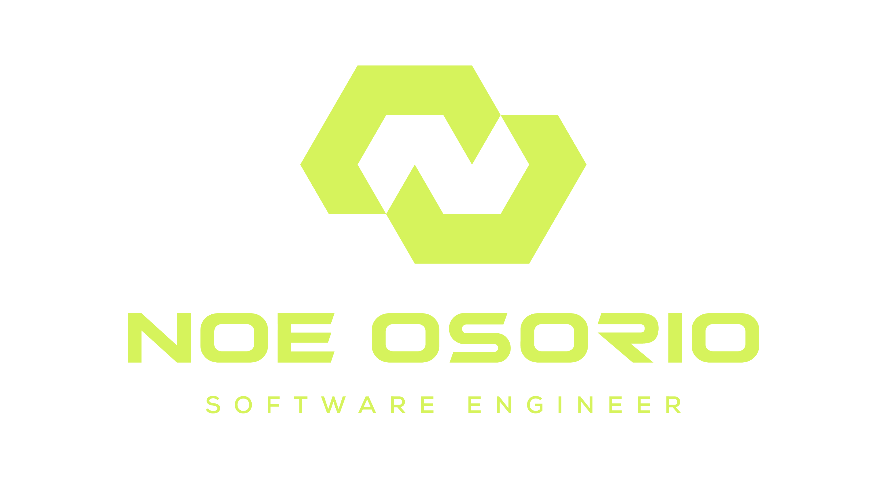
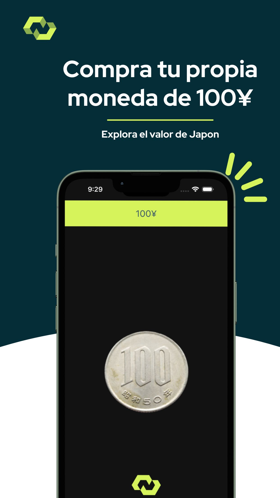

# 100 Yenes 💴

Una sencilla aplicación React Native creada con Expo para explorar la moneda de 100 yenes japoneses, diseñada como una guía práctica para aprender a subir aplicaciones a la App Store.

## 📸 Capturas de Pantalla

## 🚀 Descripción

"100 Yenes" es una aplicación educativa y visual que permite a los usuarios conocer más sobre la moneda de 100 yenes, incluyendo su historia, diseño y significado cultural en Japón. Esta aplicación sirve como un ejemplo práctico para guiar a los desarrolladores a través del proceso de publicación de aplicaciones en la App Store utilizando Expo y EAS (Expo Application Services).

## 🌟 Características Principales

- **Explora la Moneda de 100 Yenes**: Descubre detalles sobre su diseño y significado.
- **Aprende sobre Cultura Japonesa**: Entiende el contexto cultural de esta moneda en Japón.
- **Guía de Publicación en App Store**: Sirve como una referencia para aprender a publicar aplicaciones.

## 💻 Tecnologías Utilizadas

- React Native
- Expo
- EAS

## 📚 Guía para Subir la Aplicación a la App Store con EAS

1. **Preparación del Proyecto**:
   - Asegúrate de que tu proyecto esté listo para la producción, optimizando imágenes, revisando el código, y asegurando que cumple con las directrices de la App Store.

2. **Configura tu `app.json`**:
   - Añade las configuraciones necesarias para iOS, incluyendo `bundleIdentifier`, `configurations`, `icon`, etc.

3. **Regístrate en el Programa de Desarrolladores de Apple**:
   - Si aún no lo has hecho, necesitas estar registrado en el Programa de Desarrolladores de Apple para publicar en la App Store.

4. **Crea tu aplicación en App Store Connect**:
   - Configura tu aplicación en App Store Connect, añadiendo detalles como el nombre, descripción, capturas de pantalla y metadatos.

5. **Construye tu Aplicación con EAS**:
   - Ejecuta `eas build --platform ios` en la terminal para construir tu aplicación. Necesitarás configurar las credenciales de iOS si es la primera vez que construyes.

6. **Envía tu Aplicación a la App Store**:
   - Una vez que tu build esté listo, puedes utilizar `eas submit --platform ios` para enviar tu aplicación a la App Store para revisión.

7. **Espera la Revisión**:
   - Después de enviar, tu aplicación será revisada por Apple. Este proceso puede tomar de unos días a una semana.

8. **Publicación**:
   - Una vez aprobada, tu aplicación estará disponible en la App Store.

## ⚙️ Configuración del Proyecto

Para configurar y ejecutar este proyecto en tu entorno de desarrollo:

1. Clona el repositorio.
2. Ejecuta `npm install` o `yarn install` para instalar las dependencias.
3. Inicia la aplicación con `expo start`.

## 🤝 Contribuir

Si deseas contribuir a este proyecto, te invitamos a realizar un pull request o enviar un correo a [business@noeosorio.com](mailto:business@noeosorio.com).

## 📝 Licencia

Este proyecto está licenciado bajo la Licencia MIT. Consulta el archivo [LICENSE](LICENSE) para más detalles.
